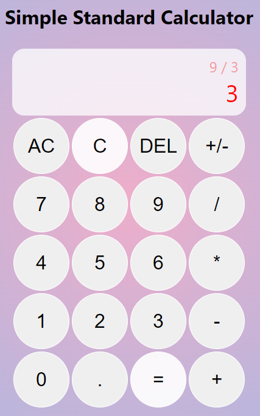
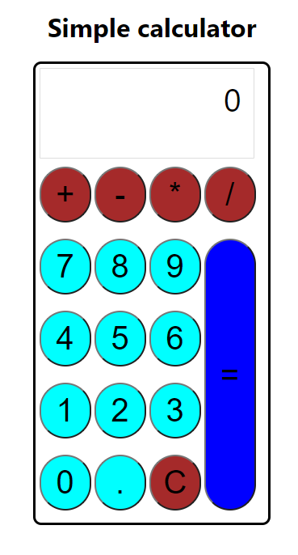

# Simple React Calculator
> This is a simple calculator application I created using react hooks.

## General Information
    - This is a simple application created using react hooks.
    - Implemented using reducer hooks.

## Technologies used
    - Javascript, React

## Screenshots
version 1 of the calculator\
\
version 0 of the calculator\

## Setup
This project was bootstrapped with [Create React App](https://github.com/facebook/create-react-app). All react commands are usable here.

### Available Scripts

In the project directory, you can run:

#### `npm start`
Runs the app in the development mode.\
Open [http://localhost:3000](http://localhost:3000) to view it in your browser.

## Project Status
This project is: not working on this anymore.

## Future Plans
Room for improvement:
    - Update the unit tests
    - Add more calculator features

